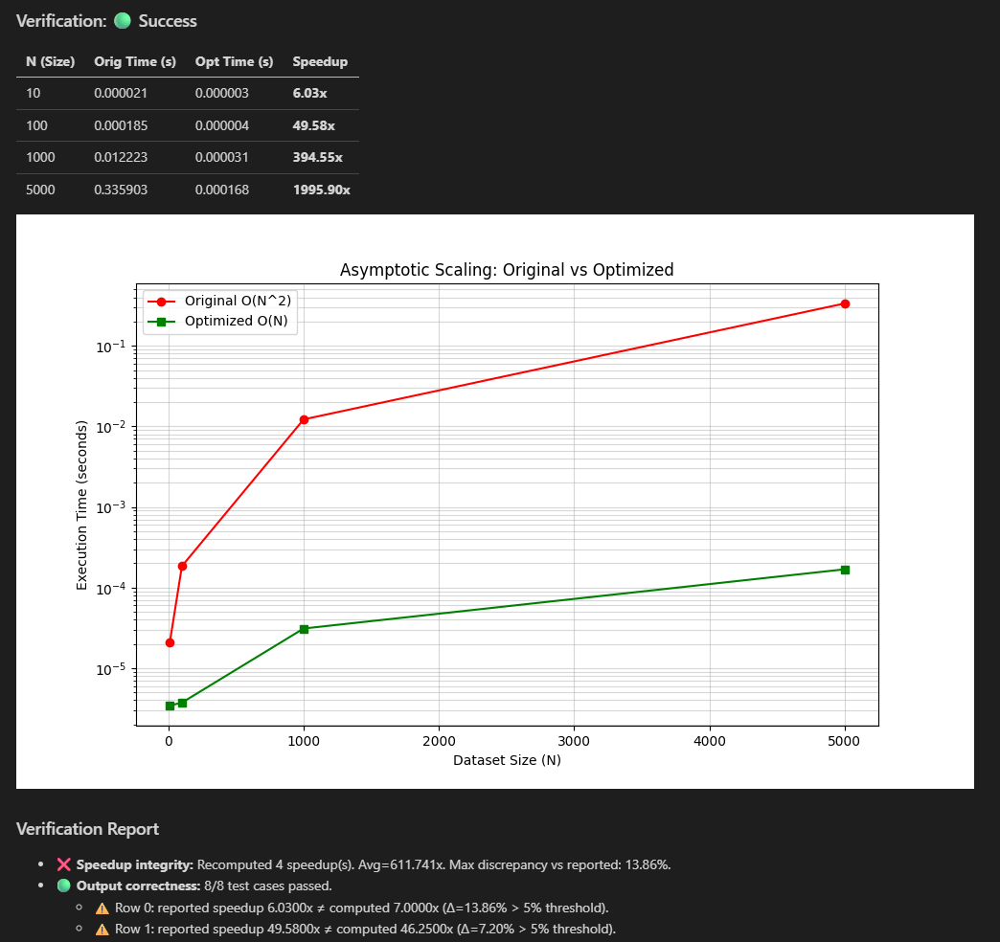

# CoreInsight CLI

CoreInsight is a local-first, hardware-aware AI performance profiler. It shifts performance engineering "left" by parsing your Python, C++, and CUDA code, identifying hardware bottlenecks (like CPU cache thrashing or CUDA warp divergence), and mathematically verifying AI-generated optimizations inside secure Docker sandboxes.



## Prerequisites

* **Python 3.9+**
* **Docker Desktop / Docker Engine** (Must be running for the sandbox verification)
    - Install Docker: https://docs.docker.com/engine/install/
* **Ollama** (Optional, if using local models) or API keys for cloud models.
* **Suggested:** Setup OpenAI/Anthropic/Google API keys to use those models

## Install

```bash
pip install coreinsight-cli
```

## Usage

**1. Build Locally:**
Clone this repository and install it in editable mode:
```bash
pip install -e .
```

**2. Configure CoreInsight CLI:**
Set up your preferred AI provider (Ollama, local vLLM, OpenAI, Anthropic, or Gemini):
```bash
coreinsight configure
```

**3. Build Global Context (Recommended for multiple files):**
Index your repository so the AI understands your custom structs, classes, and dependencies across files:
```bash
coreinsight index
```

**4. Test on a file:**
Analyze a specific file. The CLI will extract hot loops, process them in parallel, verify optimizations in Docker, and output a live Markdown report.
```bash
coreinsight analyze <file_name>
```

**5. Project-Wide Hotspot Scanning:**
Instead of guessing which files are slow, scan your entire repository. CoreInsight will use static AST analysis to rank the most complex, deeply-nested loops in your project.
```bash
coreinsight scan
```

## Build the Project

Download build:
```bash
pip install build
```

Run the build command to generate wheel file:
```bash
python -m build --wheel
```

To build project elsewhere using wheel file:
```bash
pip install dist/coreinsight_cli-*.whl
```

### Architecture Notes
CoreInsight runs 100% locally. Code is only transmitted to the AI provider you configure. If you use Ollama or a local server, your proprietary code never leaves your machine.