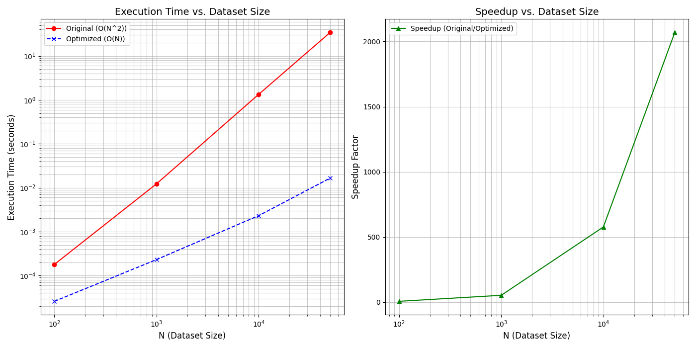

# CoreInsight CLI

**CoreInsight** is a local-first, hardware-aware AI performance profiler.
It parses Python, C++, and CUDA code, identifies hardware bottlenecks
(CPU cache thrashing, CUDA warp divergence, algorithmic complexity issues),
generates optimized code using an LLM, and mathematically verifies the
results inside isolated Docker sandboxes with no data leaving your machine
unless you explicitly configure a cloud provider.



---

## How it works

CoreInsight is built around three pillars:

**1. Two-pillar mathematical verification:**
Every optimization is verified by two independent checks before being
accepted and not just trusted because the AI said so:
- **Speedup integrity:** Recomputes speedup from raw timing columns and
  cross-checks against reported values, flagging fabricated or suspicious
  results
- **Output correctness:** Spins up a fresh Docker container, runs both
  original and optimized functions on identical test inputs, and compares
  outputs with float tolerance

**2. AI-free hardware evidence**
On top of sandbox verification, CoreInsight runs real profiling tools
against both versions and reports hardware counters — wall time, 
total function calls, cache misses, CPU cycles — as deterministic, 
LLM-independent evidence. This is the number a code
reviewer or auditor can trust.

**3. Optimization memory**
Every verified optimization is stored in a local vector database
(ChromaDB). On subsequent analyses, CoreInsight retrieves structurally
similar past optimizations before calling the LLM. When a match is found,
the entire LLM + sandbox pipeline is skipped and the stored result is
returned instantly. The tool gets faster and smarter the longer you use it and saves token cost over time.

---

## Prerequisites

- **Python 3.9+**
- **Docker Desktop / Docker Engine:** Must be running for sandbox
  verification. Install: https://docs.docker.com/engine/install/
- **Ollama:** Frr local inference (default).
  Install: https://ollama.com/download, then `ollama pull llama3.2`
- **Recommended:** OpenAI / Anthropic / Google API keys for cloud models (Pro)

---

## Install
```bash
pip install coreinsight-cli
```

Or clone and install in editable mode for development:
```bash
git clone https://github.com/your-org/coreinsight
cd coreinsight
pip install -e .
```

---

## Quick start
```bash
# Step 1: Configure your AI provider (defaults to Ollama + llama3.2)
coreinsight configure

# Step 2: Run the built-in demo to verify everything works
coreinsight demo

# Step 3: Analyse your own file
coreinsight analyze path/to/your_file.py
```

---

## All commands

### `coreinsight analyze <file>`
Analyse a `.py`, `.cpp`, or `.cu` file. Extracts functions, runs
bottleneck analysis in parallel, benchmarks in Docker, verifies
mathematically, and writes a live Markdown report next to the source file.
```bash
coreinsight analyze src/matrix_ops.py
coreinsight analyze kernels/sort.cpp
```

### `coreinsight demo [--lang python|cpp]`
Run CoreInsight on a built-in example to see the full pipeline end-to-end.
```bash
coreinsight demo
coreinsight demo --lang cpp
```

### `coreinsight memory [--clear]`
Inspect the local optimization memory store wjocj shows every verified
optimization with function name, language, measured speedup, severity,
issue summary, and hardware evidence.
```bash
coreinsight memory          # list stored optimizations
coreinsight memory --clear  # wipe the store
```

### `coreinsight index [--dir <path>]`
Index a repository into a local vector database so the AI has cross-file
context (custom structs, helper functions, dependencies) during analysis.
```bash
coreinsight index
coreinsight index --dir ./src
```

### `coreinsight scan [--dir <path>] [--top N]`
Scan a directory with static AST analysis and rank the most complex,
deeply-nested hotspots without touching the LLM. Useful for triaging
large codebases before a full analysis.
```bash
coreinsight scan
coreinsight scan --dir ./src --top 20
```

### `coreinsight configure [--pro-key <key>]`
Set up your AI provider and API keys interactively. 
Pass `--pro-key` to unlock Pro features.
```bash
coreinsight configure
coreinsight configure --pro-key <your-key>
```

### `coreinsight configure [--agent-mode <mode>]`
Choose between single-agent or multi-agent mode.
Pass `--agent-mode multi` for multi-agent usage.
```bash
# Explicit override
coreinsight configure --agent-mode multi
coreinsight configure --agent-mode single

# Reset to auto-selection
coreinsight configure --agent-mode auto
```

---

## Supported languages

| Language | Analysis | Benchmarking | Correctness | Hardware profiling |
|:---------|:--------:|:------------:|:-----------:|:------------------:|
| Python   | ✅        | ✅            | ✅           | ✅ (Pro)            |
| C++      | ✅        | ✅            | ✅           | 🔜 v0.2.1          |
| CUDA     | ✅        | ✅            | —            | 🔜 v0.2.1          |

---

## Supported AI providers

| Provider | Tier | Setup |
|:---------|:----:|:------|
| Ollama (local) | Free | `ollama pull llama3.2` |
| LM Studio / vLLM (`local_server`) | Free | Point to `http://localhost:1234/v1` |
| OpenAI | Pro | API key via `coreinsight configure` |
| Anthropic | Pro | API key via `coreinsight configure` |
| Google Gemini | Pro | API key via `coreinsight configure` |

All local providers run 100% on-device — no data leaves your machine.

---

## Tiers

| Feature | Free | Pro |
|:--------|:----:|:---:|
| Local providers (Ollama, LM Studio) | ✅ | ✅ |
| Cloud providers (OpenAI, Anthropic, Gemini) | — | ✅ |
| Functions per file | 3 | Unlimited |
| Retry attempts | 2 | 5 |
| Correctness test cases | 8 | 15 |
| AI-free hardware profiling | — | ✅ |
| Optimization memory | ✅ | ✅ |

---

## Architecture
```
coreinsight/
├── main.py       CLI entry point, parallel execution, Rich UI, report generation
├── analyzer.py   LLM chain: bottleneck analysis, harness generation, test cases
├── sandbox.py    Docker execution, speedup integrity, output correctness
├── profiler.py   AI-free hardware profiling (cProfile, perf stat)
├── memory.py     Optimization memory store (ChromaDB, semantic + exact lookup)
├── parser.py     AST parsing via tree-sitter for Python, C++, CUDA
├── indexer.py    RAG repo indexer (ChromaDB + sentence-transformers)
├── hardware.py   Hardware detection for LLM context
├── scanner.py    Project-wide hotspot scanner
├── config.py     Provider config, tier limits, pro key activation
└── prompts.py    System prompt, analysis template, tiered harness addenda
```

All verification runs inside Docker with network disabled, memory limits
enforced, and all capabilities dropped. The LLM sees your code; the
sandbox never phones home.

---

## Output

Every analysis writes a Markdown report next to your source file:
```
your_file_coreinsight_report.md
your_file_benchmark_plot.png     # Python only
```

The report includes the optimized code, benchmark table, verification
results, and (Pro) a Hardware Evidence section with deterministic profiler
output — suitable for sharing with a team or attaching to a PR.

---

## Get Pro: Free while this tool is in beta

Pro features (cloud providers, AI-free hardware profiling, unlimited
functions) are **free during the beta period**. Pro keys are being handed
out manually right now.

**Request a key:** [tally.so/r/xXZ9YE](https://tally.so/r/xXZ9YE)

Once you have a key:
```bash
coreinsight configure --pro-key <your-key>
```

## Privacy

CoreInsight is local-first by design:
- **Ollama / local_server** — code never leaves your machine
- **Cloud providers** — only the function code and context you choose to
  analyse is sent to the provider's API, under your own key
- The optimization memory store lives at `~/.coreinsight/memory_db` on
  your local filesystem

## Troubleshooting

ChromaDB issue with old SQLite3 versions. To resolve:
```bash
pip install pysqlite3-binary # >=0.5.0
```
